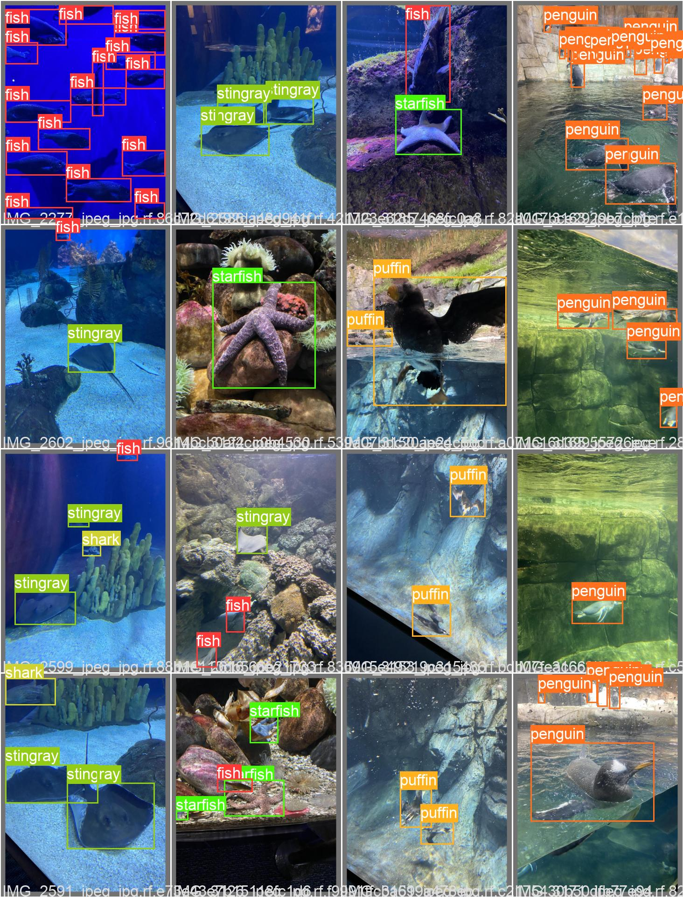

<h1>Object Detection of fish swimming in aquarium </h1>

In this project I am trying to build an object detection model that is as accurate as possible,
when it comes to the detection of fish in an aquirium. 
The use case for this is to detect fish in a video stream, and then use the model to predict the location of the fish in the video.

Derived from these predictions we can then make different assumptions: Where do fish like to swim in a tank and can we predict where they will swim to?

<h1>Background Info</h1>

The model that was used is a yolov5 model. The model was trained on the fish dataset, and the dataset was taken from  <a href="https://public.roboflow.com/object-detection/aquarium">roboflow.com</a>

YOLOv5 🚀 is a family of object detection architectures and models pretrained on the COCO dataset, and represents <a href="https://ultralytics.com">Ultralytics</a>
 open-source research into future vision AI methods, incorporating lessons learned and best practices evolved over thousands of hours of research and development.

   

## Licence

## Credits
https://ultralytics.com/  
https://roboflow.ai/

